# **Assignment 2 – Business Intelligence Report**

## **Power Query Data Preparation Lab**

---

## **Task 1: Data Ingestion & Staging**

First, I loaded all three datasets into Power BI.

* Clicked **Get Data → Excel Workbook**
* Selected each file one by one
* Clicked **Transform Data** instead of Load, so that all cleaning happens inside Power Query

The three files imported were:

* AfriRetail_Sales_Dirty
* AfriRetail_Products_Dirty
* AfriRetail_Regions_Dirty

After loading, I renamed all queries using my own naming style for clarity and BI professionalism.

### Query Identification

I classified the queries as follows:

* **stagedSales** → Fact Table (transaction-level sales data)
* **stagedProducts** → Lookup/Dimension Reference Table
* **stagedRegions** → Lookup Table (country-to-region mapping)

📌 **Screenshot 1 (Task 1): Query Organization**
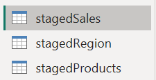
---

---

## **Task 2: Data Profiling & Quality Assessment**

In **stagedSales**, I used Power Query profiling tools to assess data quality.

I enabled:

* Column Quality
* Column Distribution
* Column Profile

This helped identify multiple data issues.

### Issues Found in Sales Data

1. **Transaction Date**

   * Column had an invalid type (was numerical instead of Date)

2. **Unit Price**

   * Stored inconsistently and needed to be converted to decimal/float

3. **Sales Amount**

   * Was stored as text (alpha values) instead of numeric
   * Contained around **26% empty values**

4. **Quantity Column**

   * Contained invalid values such as negative quantities

### Flag Column for Problem Records

To handle invalid quantities, I created a flag column using an IF condition:

* Quantity < 0 → Invalid
* Else → Valid

📌 **Screenshot 2 (Task 2): Column Profiling Evidence**
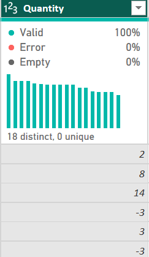

📌 **Screenshot 3 (Task 2): Flag Column Step**
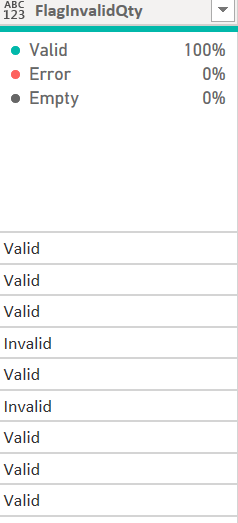

---

---

## **Task 3: Data Cleaning & Standardization**

In this step, I cleaned and standardized all datasets to make them analysis-ready.

### Removed Unnecessary Columns

I removed irrelevant columns such as:

* Sales Rep (not required for analysis)

📌 **Screenshot 4 (Task 3): Removed Columns Step**
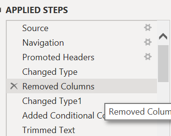

---

### Text Cleaning for Consistency

I applied **Trim** and **Clean** transformations to multiple text fields:

* Payment Method → Cleaned, Trimmed, Uppercase
* Category → Cleaned, Trimmed, Uppercase
* Product Name → Cleaned, Trimmed
* Country → Cleaned, Trimmed, Uppercase
* Branch → Cleaned, Trimmed, Capitalized Each Word

📌 **Screenshot 5 (Task 3): Text Cleaning Step**
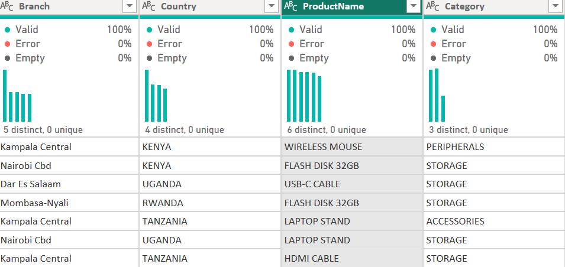
---

### Data Type Enforcement

I corrected column data types:

* Transaction Date → Date
* Quantity → Whole Number
* Unit Price → Decimal Number
* Sales Amount → Numeric

📌 **Screenshot 6 (Task 3): Data Type Enforcement**
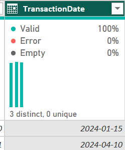, 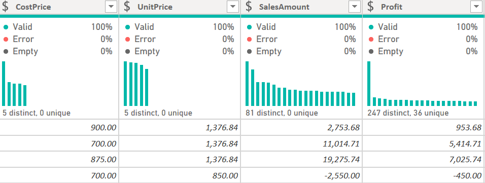
---

### Handling Missing Values (Business Justification)

#### Transaction Date

Null dates were removed because the date is essential for:

* Time series analysis
* Trend reporting
* Financial forecasting

Imputing dates would introduce unreliable artificial patterns.

#### Unit Price

Null Unit Prices were imputed using the average because:

* Price is required to compute sales values
* Businesses need complete financial metrics

#### Sales Amount

Sales Amount had many errors and missing values.
Instead of keeping unreliable entries, I replaced it with a calculated metric:

* Sales Amount = Quantity × Unit Price

This is logically consistent because both fields already exist.

📌 **Screenshot 7 (Task 3): Calculated Sales Amount Column**
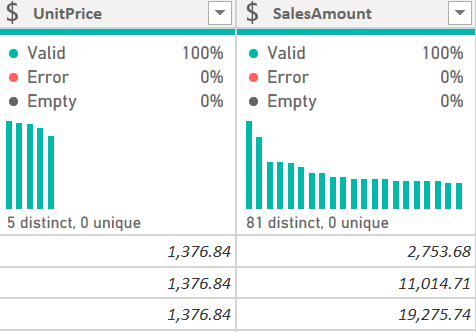
---

### Quantity Errors

Quantity contained negative values, so I flagged them rather than deleting rows without explanation.

---

---

## **Task 4: Data Integration (Merge & Append)**

Before merging, I cleaned both lookup tables:

### Regions Table Cleaning

* Trimmed and cleaned country names
* Deleted the first row (header issues)
* Capitalized country values
* Removed duplicates
* Replaced erroneous values with correct ones

### Products Table Cleaning

* Cleaned and trimmed product names
* Imputed missing cost prices using mean
* Standardized text casing
* Removed duplicates

After cleaning, I merged:

* stagedSales + stagedProducts
* stagedSales + stagedRegions

I used **Left Outer Join** to ensure no sales records were dropped unintentionally.

📌 **Screenshot 8 (Task 4): Merge Operation Window**
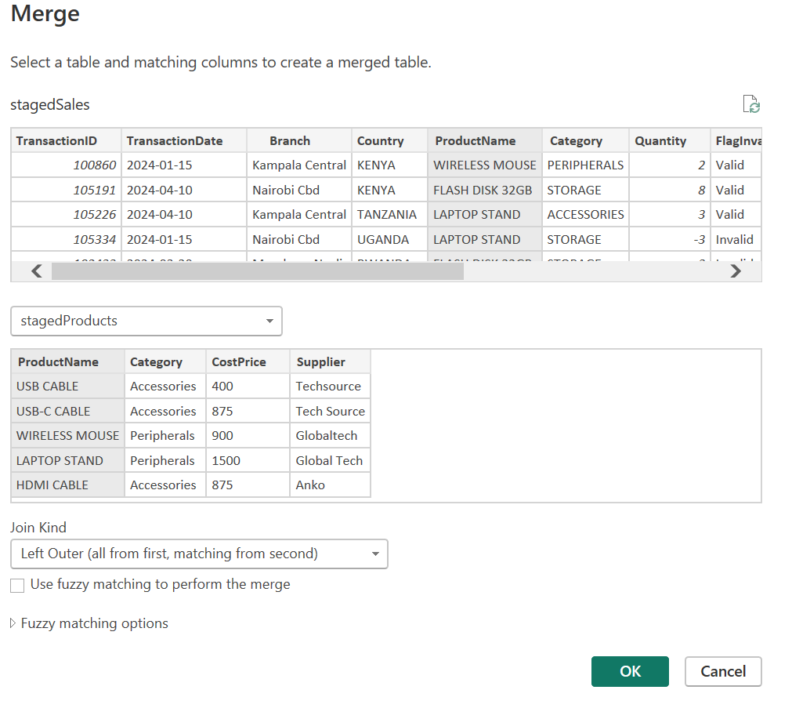

📌 **Screenshot 9 (Task 4): Expanded Columns After Merge**
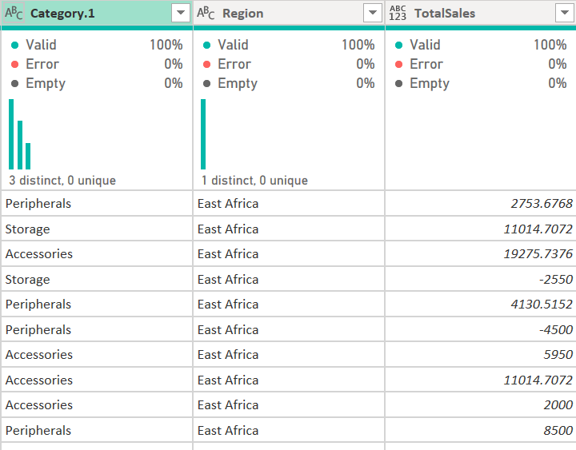
---

---

## **Task 5: Business Transformations**

Using Power Query only, I created key business metrics:

### Total Sales Column

Created using:

* TotalSales = Quantity × Unit Price

### Profit Column

Created using:

* Profit = (Unit Price – Cost Price) × Quantity

### Performance Band

Grouped sales into:

* High
* Medium
* Low

based on TotalSales thresholds.

📌 **Screenshot 10 (Task 5): Profit or TotalSales Column Step**
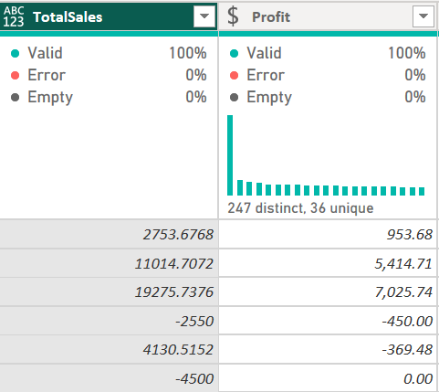
---

---

## **Task 6: Dimension Tables & Aggregation**

I created dimension tables for a star schema:

* dimProducts (unique product list)
* dimRegions (unique countries/regions)

Duplicates were removed correctly.

I also created an aggregated summary table:

* Total Sales by Country (Group By)

📌 **Screenshot 11 (Task 6): Dimension Table Query**
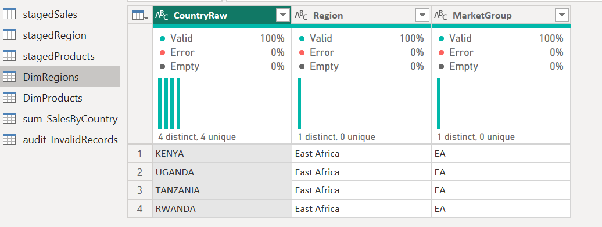

📌 **Screenshot 12 (Task 6): Aggregated Group By Table**
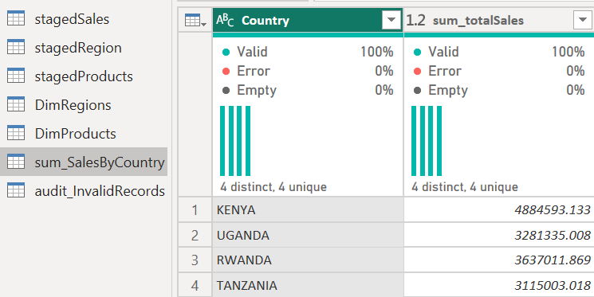

---

---

## **Task 7: Data Governance & Load Control**

To ensure professional BI governance:

* I created an audit query that isolates records requiring review:

  * Negative quantities
  * Missing region matches
  * Missing prices/costs

* I disabled load for staging queries so only clean tables enter the model.

📌 **Screenshot 13 (Task 7): Audit Query Filter**
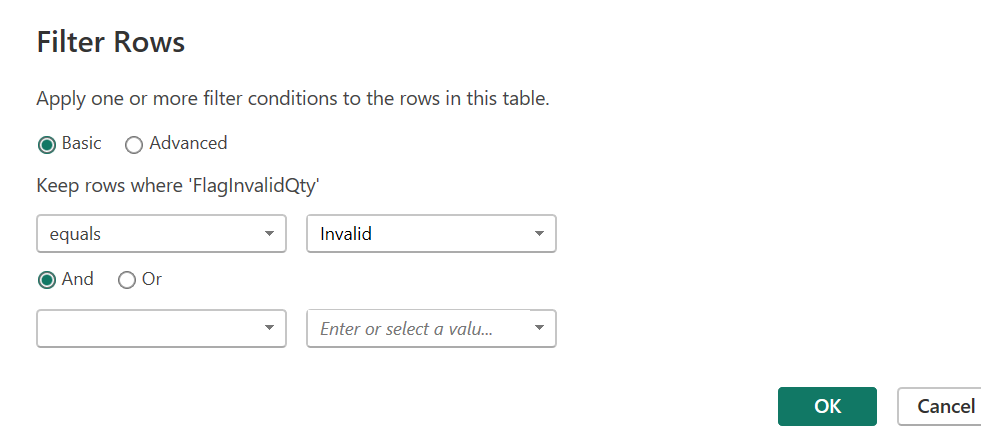

📌 **Screenshot 14 (Task 7): Load Disabled for Staging Tables**
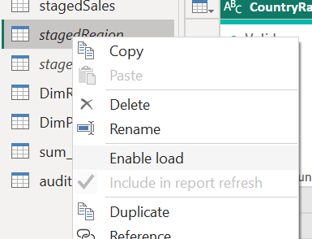

---

---

# ✅ Conclusion

All datasets were cleaned, standardized, integrated, and transformed entirely in Power Query without editing the source files externally.
The final output is an analysis-ready star schema model with supporting audit and summary tables suitable for accurate reporting.

---

