# 🚗 Adult Income Dataset (1994)

### DAX Assignment

**Course:** DSA3050A – Business Intelligence & Data Visualization
**Student:** Tanveer
**Student ID:** 752

**Link to DASHBOARD:** 

- https://app.powerbi.com/view?r=eyJrIjoiMTg3YmRhMGItNDdlMS00NjUxLTk3MDctMWRmZmMxYWVhM2E5IiwidCI6IjE2ZDgzZWU2LTI1NGEtNDY5ZC1hNmNjLTU0ZTJjYTIzMTNlNyIsImMiOjh9

---
# 📊 Dataset Information

**Source:** UC Irvine Machine Learning repository
**Dataset:** Adult
**Provider:** 1994 census dataset
**Rows:** 48842

Dataset link:
[https://archive.ics.uci.edu/dataset/2/adult](https://archive.ics.uci.edu/dataset/2/adult)

### Proof of Website

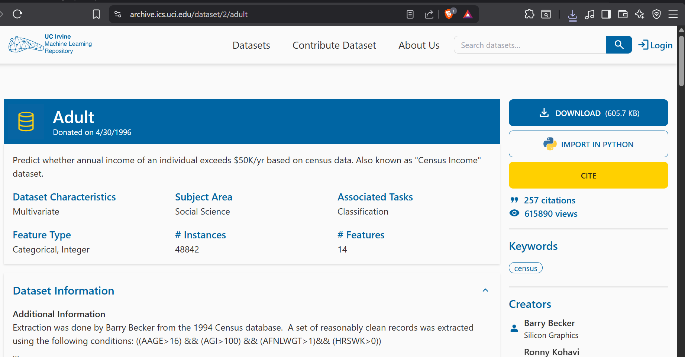

### Dataset

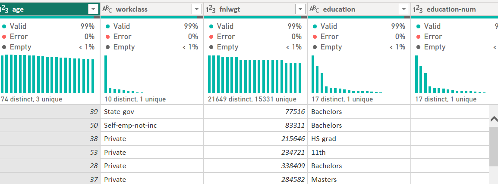

# SECTION A: DATA MODEL VALIDATION 

### Creating Date Table

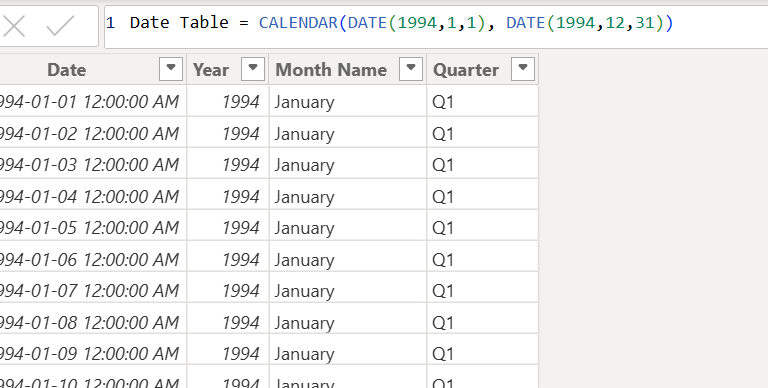

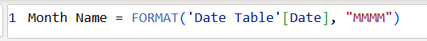

### Creating relationship

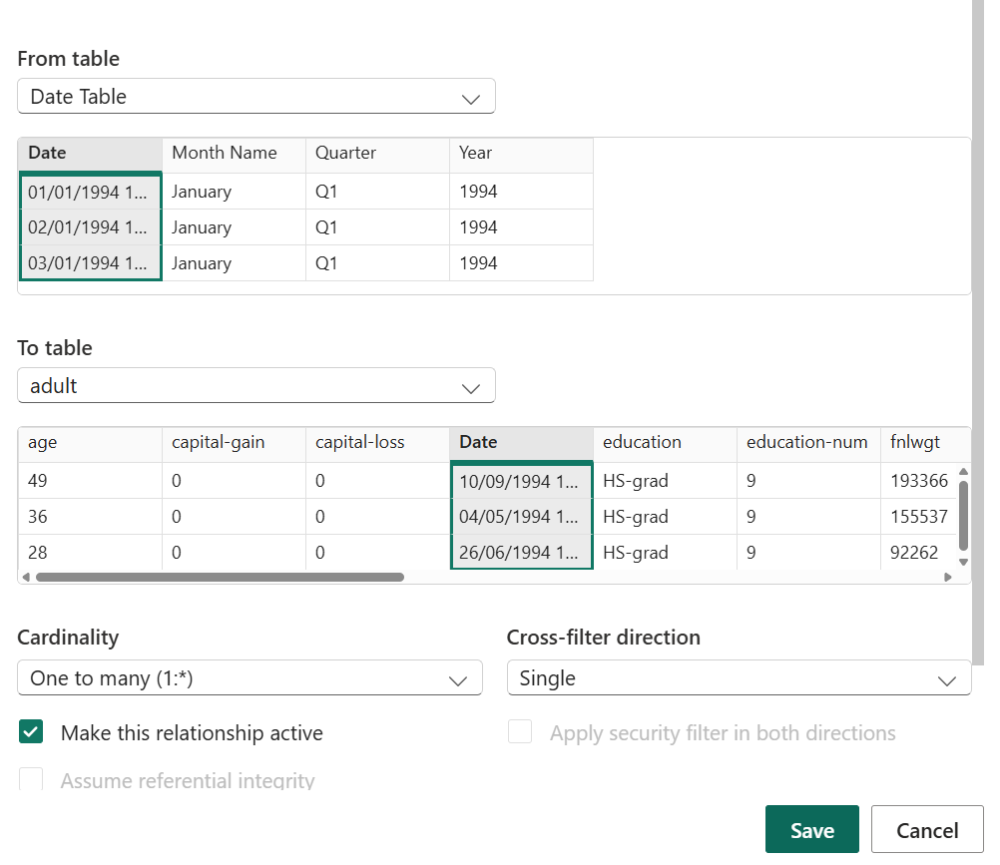

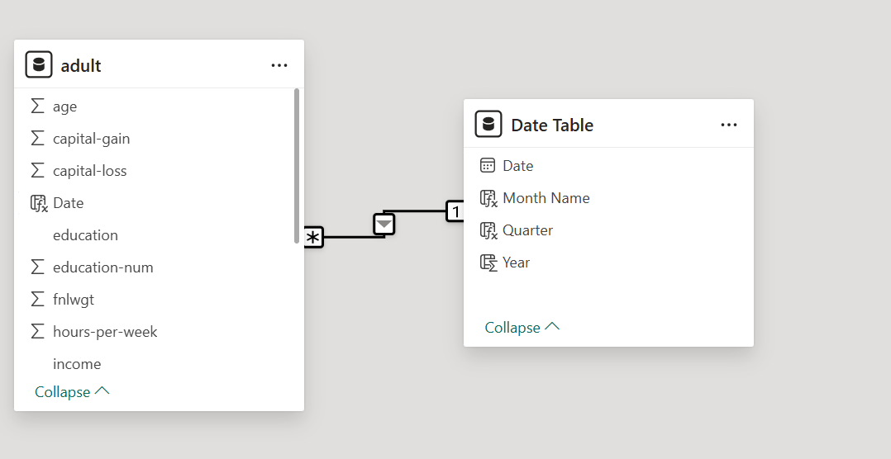

# SECTION B: CORE DAX MEASURES

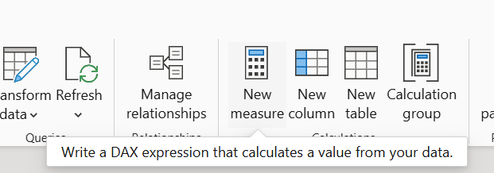

### Measure 1: Total individuals

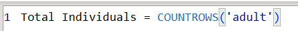

### Measere 2: Average worked hours

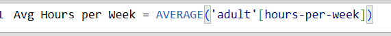

### Measure 3: High Income count

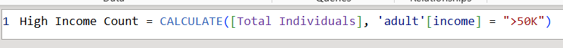

### Measere 4: High income percentage

### Measure 5: Low income Count

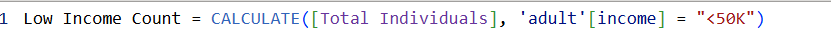

# SECTION C: CALCULATED COLUMNS

### Column 1:  Age Group Classification

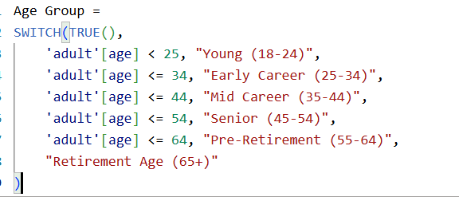

### Column 2: Work Hours Category

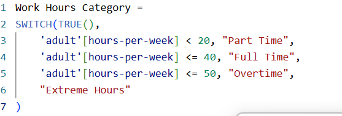

### Column 3:  Education Level Group

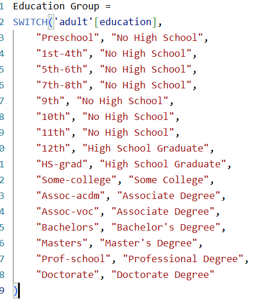

# SECTION D: FILTER CONTEXT & CALCULATE

### Measure 1: Female High Income percentage

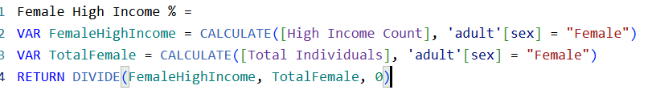

### Measure 2: Percentage of National Average 

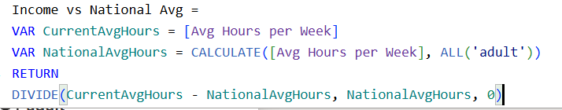

### Measure 3: Professional Contribution

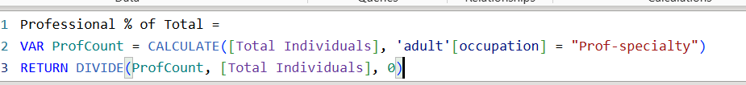

### Measure 4: Gender Gap Analysis

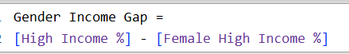

#  SECTION E: ITERATOR FUNCTION

### Total Estimated Income (SUMX)

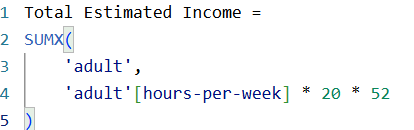

### Average Education Level by Occupation (AVERAGEX)

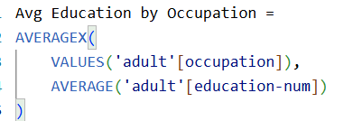

### Total Capital Activity (SUMX with multiple columns)

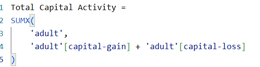

# SECTION F: TIME INTELLIGENCE

### Measure 1: Year-to-Date Individuals

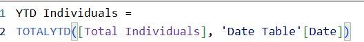

### Measure 2: Previous Quarter (comparing to last period)

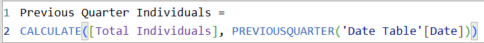

### Measure 3: Quarter-over-Quarter Growth percentage

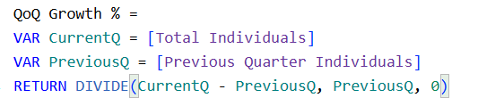

### Measure 4: Same Period Last Year

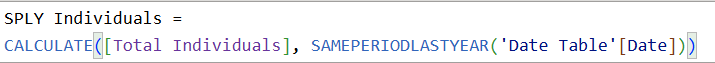

# SECTION G: VISUAL VALIDATION

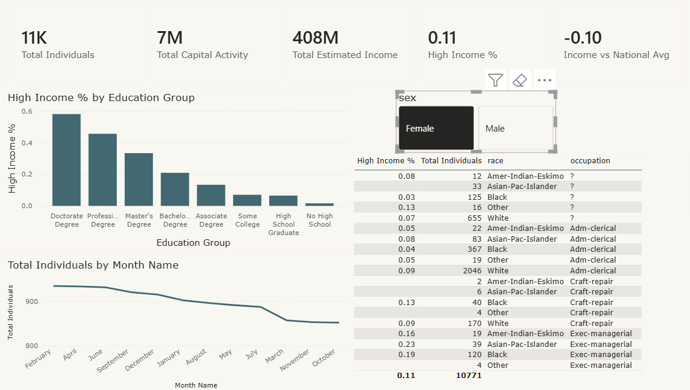

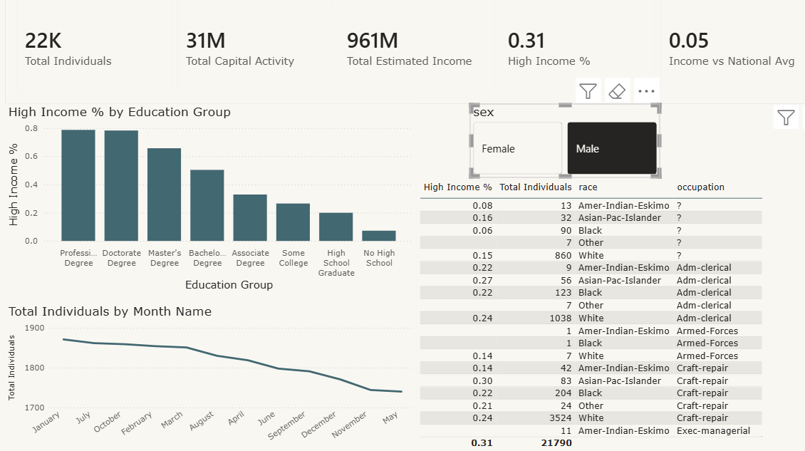

