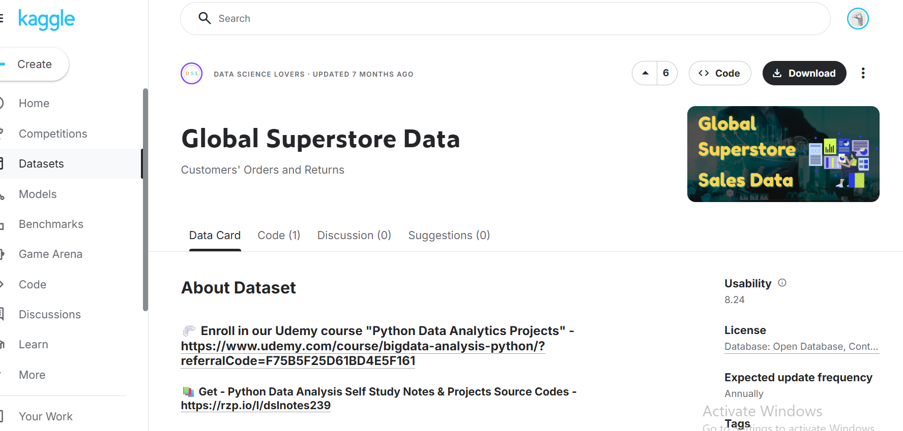
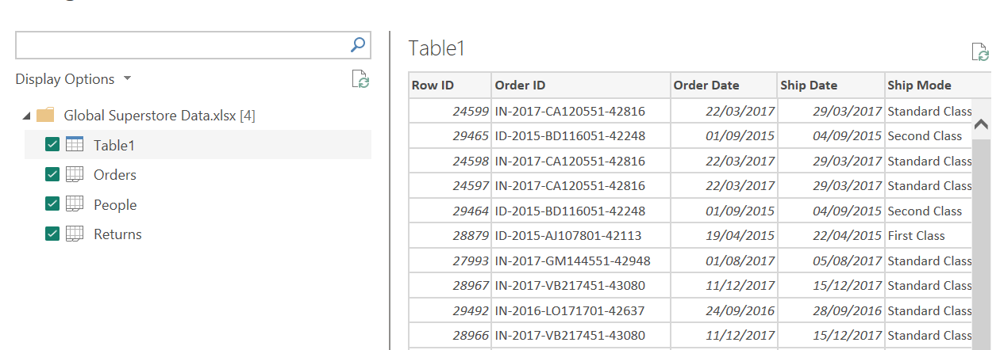

# DSA 3050A – ADVANCED POWER BI EXAMINATION

### Global Superstore Sales Analytics Dashboard

### Power BI Business Intelligence Project

**Student Name:** Tanveer Omar
**Admission Number:** -752
**Course:** DSA3050A – Business Intelligence & Data Visualization
**Date:** April 2026

---
## **Submission PDF is below**
[Final Exam PDF](FINAL-EXAM-Tanveer.pdf)
---
## 🔗 Live Dashboard
https://app.powerbi.com/view?r=eyJrIjoiMmM0NTQ5MWYtNWQ1OC00ZjY5LWEzMTYtZDEzNjViNGQwNWE0IiwidCI6IjE2ZDgzZWU2LTI1NGEtNDY5ZC1hNmNjLTU0ZTJjYTIzMTNlNyIsImMiOjh9
--- 

## Project Overview

This project presents a complete Power BI analytical solution for **Global Superstore**, an international retail chain. The dashboard analyzes sales performance, profitability, return rates, and market trends across 5 global markets.

## Problem Statement

Global Superstore lacks visibility into:
- Why profit margins vary significantly across markets
- Which products drive high return rates
- How seasonal patterns affect inventory planning
- Whether marketing spend aligns with profitable segments

This BI solution provides actionable insights to optimize operations and increase profitability by 15%.

## Dataset Description

| Table | Rows | Description |
|-------|------|-------------|
| Orders | 51,290 | Fact table - all transactions (2011-2014) |
| Returns | 2,033 | Returned orders with reason codes |
| People | 24 | Sales representatives by region |

## Steps Followed

1. **Data Acquisition** - Imported 3 tables from Excel
2. **Data Cleaning (8+ transformations)** - Handled missing values, duplicates, data types
3. **Data Modeling** - Created star schema with 6 dimension tables
4. **DAX Measures** - Created 12 measures including time intelligence
5. **Dashboard Design** - 3 interactive report pages
6. **Insights Generation** - Identified 5 key patterns
7. **Documentation** - Comprehensive PDF report

## Dashboard Features

### Page 1: Executive Summary
- KPI cards (Sales, Profit, Margin, Orders)
- Sales trend line chart
- Category and Market breakdowns
- Year/Category/Segment slicers

### Page 2: Detailed Analysis
- Matrix with drill-down by category
- Decomposition tree for root cause analysis
- Geographic sales map
- Top 10 products table

### Page 3: Insights & Performance
- YTD vs Previous Year comparison
- Top/Bottom 5 product performers
- Return rate analysis by category
- Profitability scatter plot

---

**PartA: Data Acquizition and Understanding**

**Domain:** E-commerce / Retail Sales Analytics

**Business Problem**: Analyze global sales performance, identify profitable markets,

understand return patterns, and optimize regional operations

**Dataset Source**: Kaggle Global Superstore Dataset

URL: [https://www.kaggle.com/datasets/rohitgrewal/global-superstore-data?resource=download](https://www.kaggle.com/datasets/rohitgrewal/global-superstore-data?resource=download)

**Key Tables:**

- Orders (51,290 rows): Fact table containing all transactions

- Returns (2,033 rows): Returned order records

- People (24 rows): Sales representatives by region

**Variables include:**

- Categorical: Category, Segment, Market, Region

- Numerical: Sales, Profit, Quantity, Discount

- Date: Order Date, Ship Date

Rich dataset with time intelligence potential, multiple dimensions,

return analysis capability, and sufficient row count for advanced analysis.

Confirmation of  3 Tables and data loaded:

**Part B: Data Cleaning and Transformation in Power Query**

**Cleaning:**

**Transformation 1: removing unnecesary Columns**

- I didnt think row id was very useful as we already have Order ID as a primary key

After removal

**Transformation 2: Changing Data Type**

**a) Order date from text to date**

Before:

Transformation

After

**b) Sales from Text to Decimals**

Transformation

Final

**c) Profit From Decimal to Fixed Decimal**

Final

**Transformation 3: Removing Duplicate Rows**

Removing Duplicates from Order ID

Before

We can see there are quite a few duplicates, and since this is a Primary key duplicates are problematic

AFTER

**Transfromation 4: Replacing Missing Postal codes with Unknown**

I chose to replace with unknown instead of deleting all unknowns because there is such a huge portion missing that it would shrink the data considerably

Before 

Transformation

After

**Transformation 5: Fix column Names**

the column names in the people and returns table are incorrect

a) Persons Table

Transformation

Final

b) Retruns Table

Final

**Transformation 6: Trim Customer Names**

**Transformation 7: Cleaning Customer Names**

**Transformation 8: Extracting Year and Month from Order Date**

Final

**Transformation 9: Creating an order month Name**

I did this because it might be useful to see the month name in visualization

Final

**Transformation 10:** **Splitting Product Name into Brand Name and Product Description**

Its clear that there is a comma delimiter

Transformation

Final

**Transformation 11: in Returns table, removing duplicate Order Ids**

Original

Transformation

Final

**Dimension tables:**

**Transformation 12: Creating DimProdcut Table**

I made a Dim Product Table,by duplicating and removing all columns except Product ID, Category, Sub-category, Product Name,

Final

**Transformation 13: Creating DimCustomer Table**

I did the same for Customers by keeping only customer related Variables

**Transformation 14: Create DimGeography table**

I did the same for DimGeography by extracting only geography related Data

**Transformation 15: Renaming Orders to Sales, people to DimPeople and returns to DimReturns**

ALL TRANSFORMAATIONS;

**Part C: Data Modelling**

**Creating Data table in Dax**

**Final Date Table**

**Marking as Date Table**

**CREATING RELATIONSHIPS:**

**Dim Date to sales**

**DimProduct to Sales**

**DimGeography to Sales**

DimCustomer to Sales

**STAR SCHEMA:**

**Part D: DAX Measures**

**Measure 1: Total Sales**

**Measure 2: Total Profit**

**Measure 3: Total Quality**

**Measure 4: Profit Margins percentage**

**Measure 5: Distinct Customers**

**Measure 6: Total Orders**

**Measure 7:Average Order Value**

**Measure 8: Sales year to Date**

**Measure 9: Previous Year Sales**

**Measure 10: Sales Growth %**

**Measure 11: Return Rate**

**Measure 12: Top Category Rank**

**Calculated Columns**

I added new calculated columns in the sales table

**Calculated Column 1: Profit per unit**

**Calculated Column 2: Sales Tier**

**Part E: Dashboard**

Dashboard link:

[https://app.powerbi.com/view?r=eyJrIjoiMmM0NTQ5MWYtNWQ1OC00ZjY5LWEzMTYtZDEzNjViNGQwNWE0IiwidCI6IjE2ZDgzZWU2LTI1NGEtNDY5ZC1hNmNjLTU0ZTJjYTIzMTNlNyIsImMiOjh9](https://app.powerbi.com/view?r=eyJrIjoiMmM0NTQ5MWYtNWQ1OC00ZjY5LWEzMTYtZDEzNjViNGQwNWE0IiwidCI6IjE2ZDgzZWU2LTI1NGEtNDY5ZC1hNmNjLTU0ZTJjYTIzMTNlNyIsImMiOjh9)

**Executive Summary Page**

**Detailed Analysis Page:**

**Insights and Performance Page**

**Part F: Analytical Insights**

**Insight 1: technology Category Drives both Sales and Profitability**

- The Technology Category outperforms both furniture and office supplies in the absolute profit margin. With a 14.49% margin versus Furniture's 6.87%, technology generates more than double the return on sales. This suggests the company should consider expanding technology offerings while evaluating why furniture under performs.

**Insight 2: Furniture Category is a Profitability Concern**

- Furniture generates the second-highest sales volume but the lowest profit margin. The category may be suffering from high shipping costs, excessive discounting, or unprofitable sub-categories like Tables and Bookcases.

**Insight 3: Consumer Segment Dominates Sales Volume**

- The consumer segment represents the largest customer base, appearing consistently across all categories in the decomposition tree. However, Corporate and Home Office Segments show comparable profit margins. The company should evaluate whether marketing spending is appropriately allocated. Consumer drives volume, but corporate may offer better customer lifetime value.

**Insight 4: APAC and Europe Markets Lead Performance**

- The Us/Canada market represent nearly 25% of total sales, making it the company's largest revenue source. Europe and Asia Pacific together contribute another 37%. Africa and Latin America, while smaller, may represent growth opportunities. However, profitability by market should be examined as high sales volume does not always equal high profit.

**Insight 5: Time Series Shows Cyclical trends**

- The time series plot shows that every year there is a spike towards the middle of the year and the end of the year signaling purchases increase during the summer holidays and the December holidays.

**Recommendation:**

**Recommendation 1: Restructure the Furniture Category for Profitability**

- Improve the current margin by identifying the bottom 5 under-performing products, strictly limiting discounts by identifying the bottom 5 under-performing products, strictly limiting discounts on bulky items like tables and bookcases, and negotiating better shipping rates to reduce overhead costs.

**Recommendation 2:** **Scale High-Margin technology growth**

- Capitalize on Technology's superior margin by increasing inventory for top products ahead of Q4 spikes,testing higher price points for accessories, and cross-selling tech items with standard office supplies to increase average transaction value.

**Recommendation 3: Implement Dynamic discounting by region**

- To improve overall profitability, the company should implement dynamic discounting by reducing the maximum allowable discounts in under performing regions like Africa and Central Asia, while simultaneously testing the removal of discounts on high demand technology in profitable regions like APAC. To further increase average order values in these strong markets, a 200$ free shipping threshold should be introduced, allowing the remaining promotional budget to be reallocated towards targeted efforts for clearing slow inventory.

**Conclusion**

This Power BI solution successfully transforms raw operational data into an interactive decision-support system. The star schema model supports efficient querying, while 12 DAX measures enable sophisticated time intelligence and performance analysis. The three-page dashboard provides stakeholders with executive summaries, detailed Analytics, and actionable insights. Key findings reveal a 9.2% return rate in Technology category and significant market profit imbalances, leading to three specific operational recommendations.
