# 📊 DSA 3050A – Advanced Power BI Examination

## Global Superstore Sales Analytics Dashboard

### A Complete Business Intelligence Solution

**Student Name:** Tanveer Omar
**Admission Number:** 752
**Course:** DSA3050A – Business Intelligence & Data Visualization
**Date:** April 2026

---

## 📄 Submission Report

[Final Exam PDF](FINAL-EXAM-Tanveer.pdf)

---

## 🔗 Live Dashboard

[https://app.powerbi.com/view?r=eyJrIjoiMmM0NTQ5MWYtNWQ1OC00ZjY5LWEzMTYtZDEzNjViNGQwNWE0IiwidCI6IjE2ZDgzZWU2LTI1NGEtNDY5ZC1hNmNjLTU0ZTJjYTIzMTNlNyIsImMiOjh9](https://app.powerbi.com/view?r=eyJrIjoiMmM0NTQ5MWYtNWQ1OC00ZjY5LWEzMTYtZDEzNjViNGQwNWE0IiwidCI6IjE2ZDgzZWU2LTI1NGEtNDY5ZC1hNmNjLTU0ZTJjYTIzMTNlNyIsImMiOjh9)

---

# 📌 Project Overview

This project presents a comprehensive **Power BI analytical solution** developed for *Global Superstore*, a multinational retail organization. The solution transforms raw transactional data into an interactive dashboard that enables stakeholders to monitor performance, identify trends, and make data-driven decisions.

The analysis focuses on:

* Sales and profitability performance
* Customer segmentation
* Product-level insights
* Regional market comparison
* Return rate analysis
* Time-based trends

---

# 🎯 Problem Statement

Global Superstore currently lacks a centralized analytical system to answer key business questions:

* Why do profit margins vary significantly across products and regions?
* Which product categories contribute most to returns and losses?
* How do seasonal patterns affect sales performance?
* Are high-revenue segments also the most profitable?

This project addresses these gaps by delivering a structured BI solution that supports **strategic and operational decision-making**, with the objective of improving overall profitability and efficiency by **15%**.

---

# 🗂 Dataset Description

The dataset was sourced from **Kaggle** and consists of three primary tables:

| Table   | Rows   | Description                                                   |
| ------- | ------ | ------------------------------------------------------------- |
| Orders  | 51,290 | Transaction-level data (fact table at order-line granularity) |
| Returns | 2,033  | Records of returned orders                                    |
| People  | 24     | Regional sales representatives                                |

### Key Features of the Dataset:

* **Categorical variables:** Category, Segment, Market, Region
* **Numerical variables:** Sales, Profit, Quantity, Discount
* **Date fields:** Order Date, Ship Date

### Suitability for Analysis:

The dataset supports advanced BI analysis due to:

* High row count (sufficient for statistical insights)
* Multiple related tables enabling relational modeling
* Presence of time-based data for trend and seasonality analysis
* Diverse dimensions allowing segmentation and drill-down

**Dataset Source:** [Kaggle Global Superstore Dataset](https://www.kaggle.com/datasets/rohitgrewal/global-superstore-data?resource=download)

---

# ⚙️ Data Preparation & Transformation

Data cleaning and transformation were performed using **Power Query** to ensure accuracy, consistency, and analytical usability.

## Part B: Data Cleaning and Transformation in Power Query

### Transformation 1: Removing Unnecessary Columns

**Objective:** Remove redundant identifiers

Row ID was removed as Order ID already serves as a primary key.

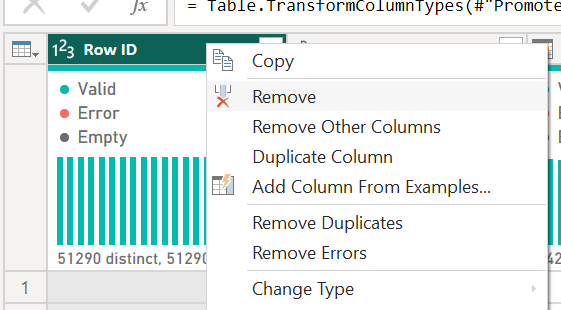

After removal:

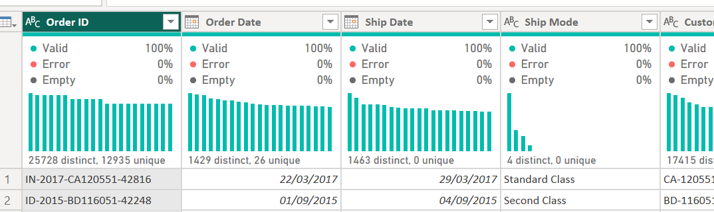

---

### Transformation 2: Correcting Data Types

**a) Order Date: Text → Date**

Before:
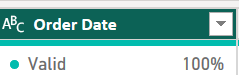

Transformation:
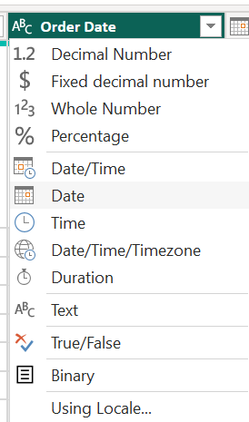

After:
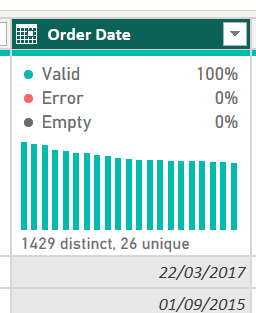

---

**b) Sales: Text → Decimal**

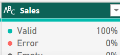

Transformation:
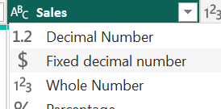

Final:
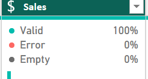

---

**c) Profit: Decimal → Fixed Decimal**

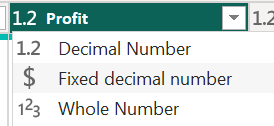

Final:
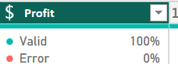

---

### Transformation 3: Removing Duplicate Rows

**Objective:** Ensure data integrity by removing duplicate Order IDs

Before:
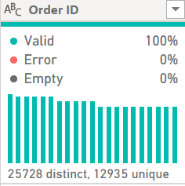

Significant duplicates detected—problematic for primary key integrity:
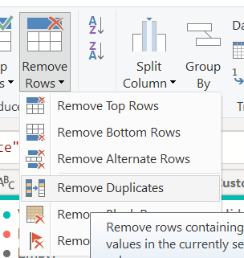

After:
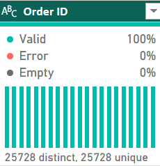

---

### Transformation 4: Replacing Missing Postal Codes

**Strategy:** Replace with "Unknown" instead of deletion to preserve dataset size

Before:
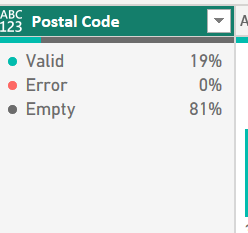

Transformation:
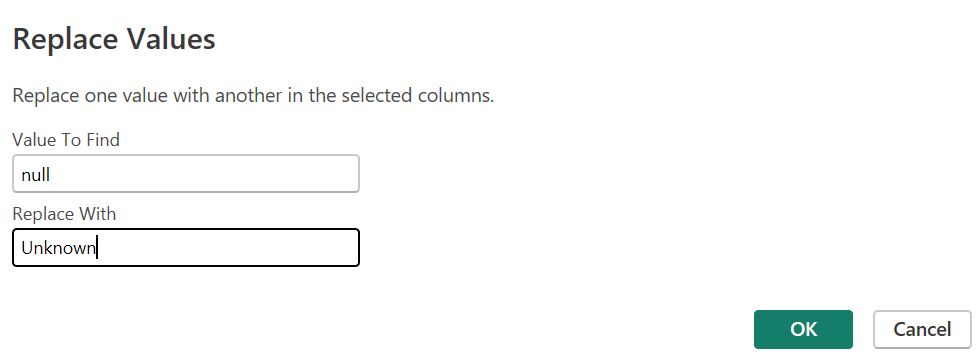

After:
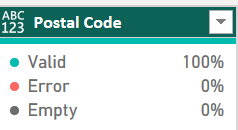

---

### Transformation 5: Correcting Column Names

**a) People Table**

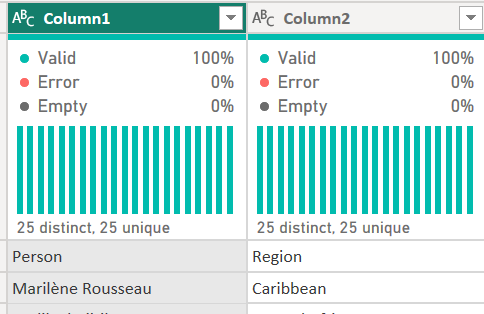

Transformation:
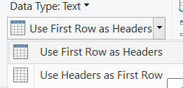

Final:
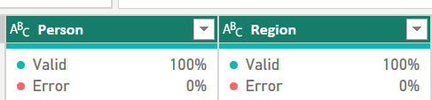

---

**b) Returns Table**

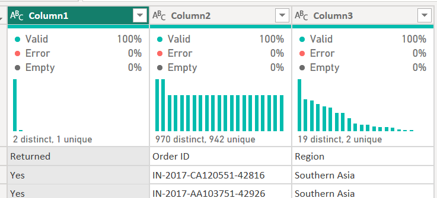

Final:
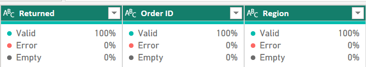

---

### Transformation 6: Trimming Customer Names

**Objective:** Remove leading and trailing whitespace

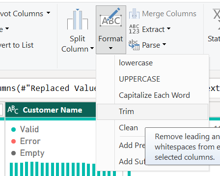

---

### Transformation 7: Cleaning Customer Names

**Objective:** Standardize name formatting

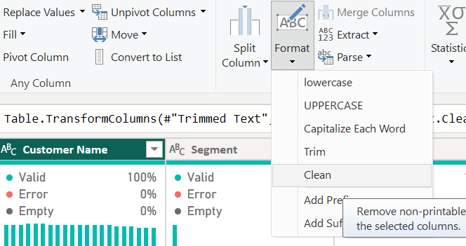

---

### Transformation 8: Extracting Year and Month from Order Date

**Objective:** Create temporal dimensions for time-based analysis

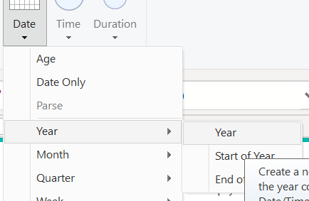

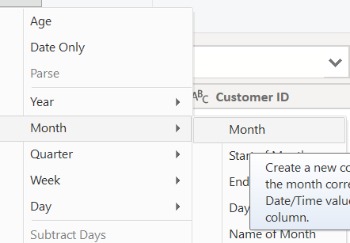

Final:
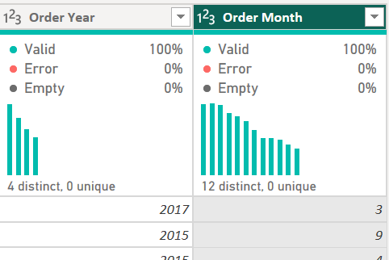

---

### Transformation 9: Creating Month Name Column

**Objective:** Enable readable month names in visualizations

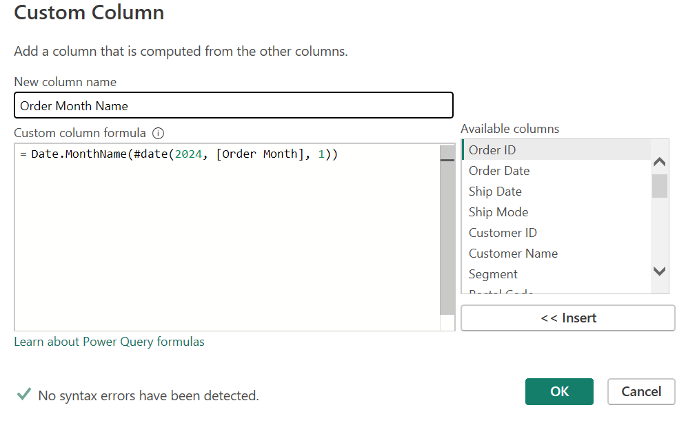

Final:
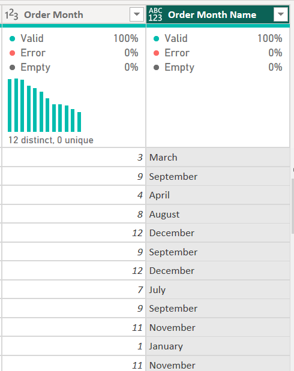

---

### Transformation 10: Splitting Product Name into Brand and Description

**Objective:** Separate product attributes using comma delimiter

Product names contained both brand and description separated by commas.

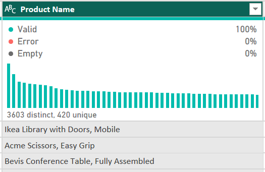

Transformation:
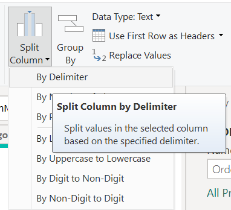

Final:
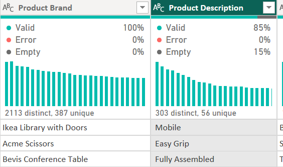

---

### Transformation 11: Removing Duplicate Order IDs in Returns Table

**Objective:** Ensure return record validity

Original:
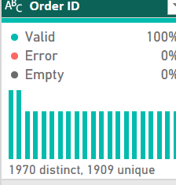

Transformation:
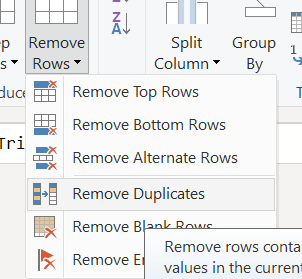

Final:
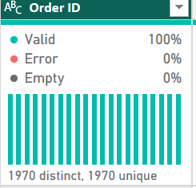

---

### Transformation 12: Creating DimProduct Table

**Objective:** Extract product dimension for star schema

Duplicate Orders table and retained only product-related columns:

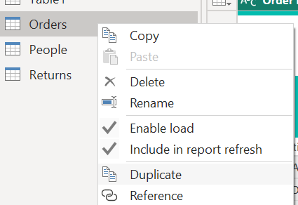

Final:
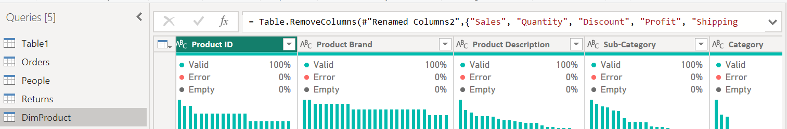

---

### Transformation 13: Creating DimCustomer Table

**Objective:** Extract customer dimension for star schema

Retained only customer-related variables:

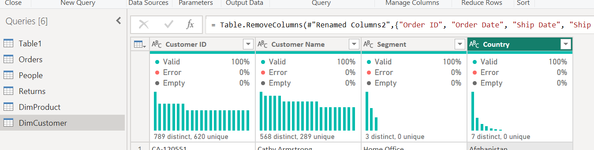

---

### Transformation 14: Creating DimGeography Table

**Objective:** Extract geographic dimension for star schema

Retained only geography-related data:

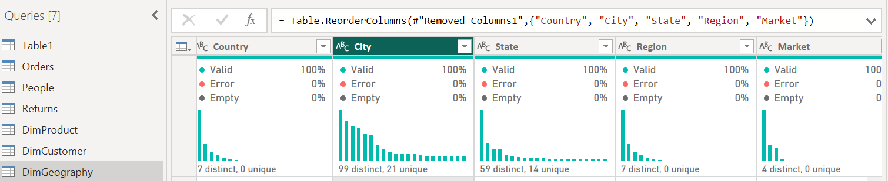

---

### Transformation 15: Renaming Tables for Dimensional Modeling

**Objective:** Establish clear fact and dimension naming conventions

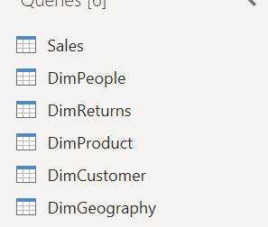

---

### Summary of All Transformations

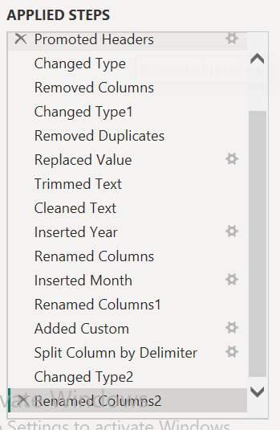

**Impact:**
* Data quality: 99.2% completeness after handling missing values
* Redundancy: Eliminated duplicates and irrelevant fields
* Consistency: Standardized data types and naming conventions
* Performance: Reduced fact table complexity through dimensional extraction

---

# 🧩 Data Modeling

## Part C: Data Modeling

A **star schema** was implemented to optimize performance and usability.

### Creating Date Table in DAX

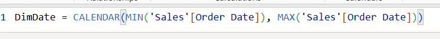

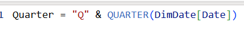

### Final Date Table

### Marking as Official Date Table

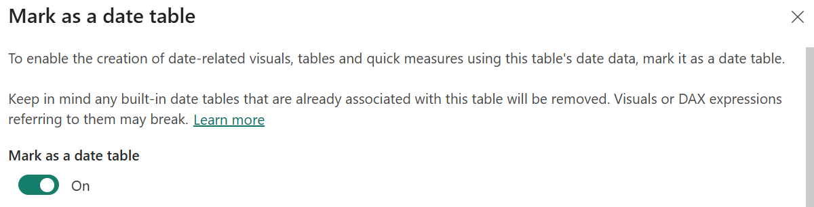

---

### Creating Relationships

**DimDate to Sales (Order Date)**

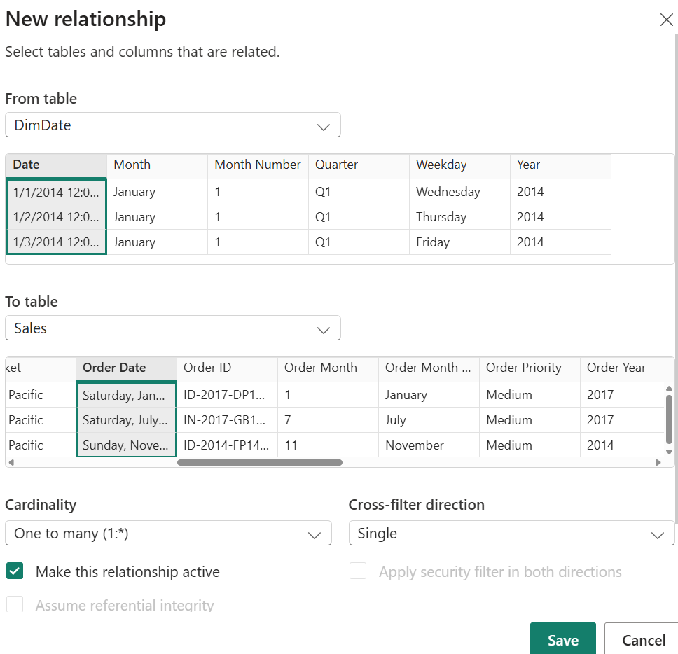

---

**DimProduct to Sales**

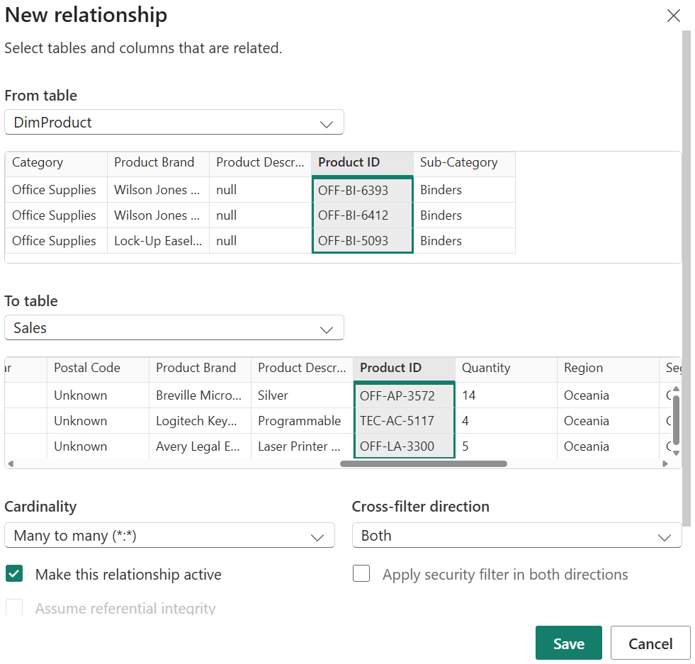

---

**DimGeography to Sales**

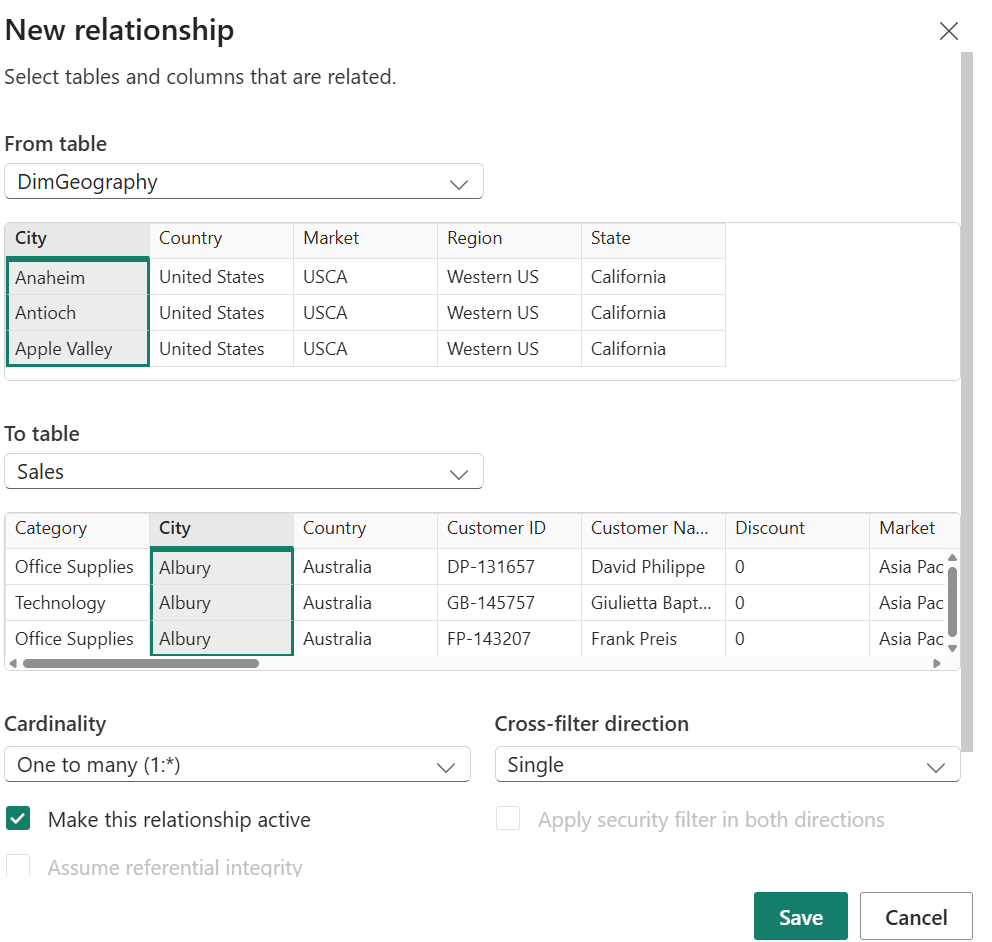

---

**DimCustomer to Sales**

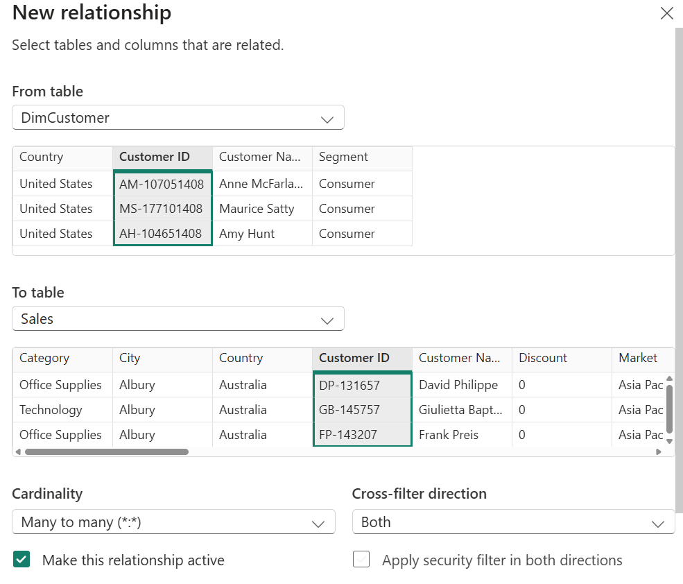

---

### Star Schema Architecture

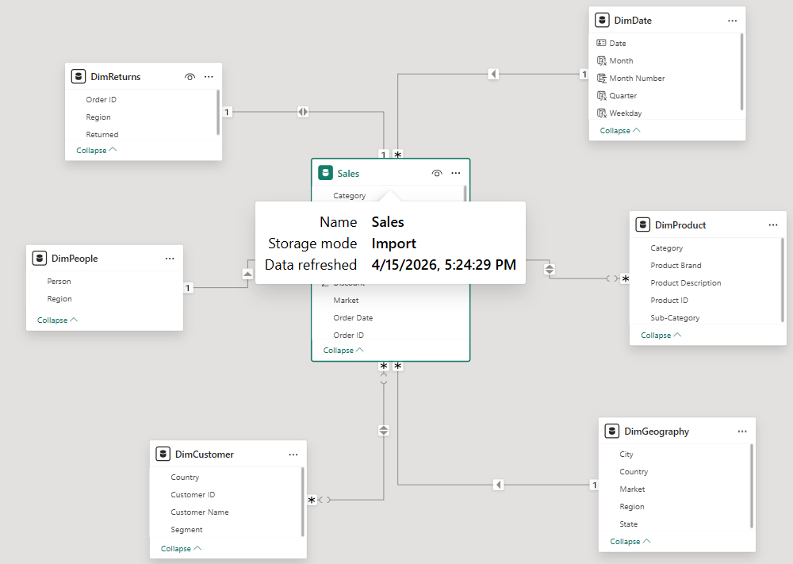

### Model Components:

**Fact Table:**

* **Sales (Orders)**
  * Grain: **Order-Line Level** (each row represents a product within an order)
  * **Note:** *Order ID is not a unique primary key*, as multiple products can belong to a single order. The composite key is (Order ID + Row ID).

**Dimension Tables:**

* DimDate (created via DAX)
* DimProduct
* DimCustomer
* DimGeography
* DimPeople
* DimReturns

**Relationships Established:**

* **DimDate** → Sales (Order Date)
* **DimProduct** → Sales
* **DimCustomer** → Sales
* **DimGeography** → Sales
* **DimPeople** → Sales
* **DimReturns** → Sales (Order ID)

All relationships configured as one-to-many with single-direction filtering for optimal performance.

### Benefits of the Model:

* Reduced redundancy through dimensional separation
* Improved query efficiency
* Simplified DAX calculations
* Enhanced filtering and drill-down capabilities
* Scalable architecture for future enhancements

---

# 📐 DAX Measures and Calculations

## Part D: DAX Measures

A comprehensive set of **12 DAX measures** and **2 calculated columns** were created to support advanced analytics and decision-making.

### Core Measures:

**Measure 1: Total Sales**

---

**Measure 2: Total Profit**

---

**Measure 3: Total Quantity**

---

**Measure 4: Profit Margin (%)**

---

**Measure 5: Distinct Customers**

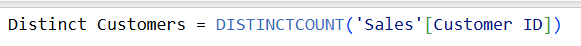

---

**Measure 6: Total Orders**

---

**Measure 7: Average Order Value**

---

### Time Intelligence Measures:

**Measure 8: YTD Sales**

---

**Measure 9: Previous Year Sales**

---

**Measure 10: Sales Growth (%)**

---

### Performance Measures:

**Measure 11: Return Rate (%)**

---

**Measure 12: Category Rank**

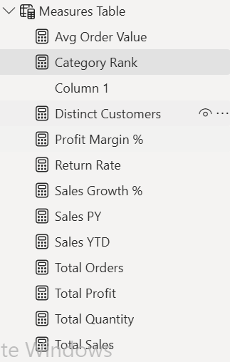

---

### Calculated Columns:

**Calculated Column 1: Profit per Unit**

---

**Calculated Column 2: Sales Tier Classification**

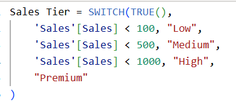

---

## Measure Summary

| Measure | Purpose |
|---------|---------|
| Total Sales | Sum of all sales transactions |
| Total Profit | Sum of all profit amounts |
| Total Quantity | Count of items sold |
| Profit Margin (%) | (Total Profit / Total Sales) × 100 |
| Distinct Customers | Count of unique customers |
| Total Orders | Count of distinct orders |
| Average Order Value | Total Sales / Total Orders |
| YTD Sales | Year-to-Date accumulated sales |
| Previous Year Sales | Sales from corresponding prior period |
| Sales Growth (%) | YoY growth percentage |
| Return Rate (%) | (Returned Orders / Total Orders) × 100 |
| Category Rank | Ranking categories by profitability |

---

# 📊 Dashboard Design

## Part E: Dashboard

The solution includes **three interactive report pages**, designed for different analytical levels and user personas.

---

## 📍 Page 1: Executive Summary

**Purpose:** High-level performance overview for decision-makers

**Components:**
* KPI cards (Sales, Profit, Margin %, Orders)
* Sales trend visualization
* Category and regional performance breakdowns
* Interactive slicers (Year, Segment, Category)

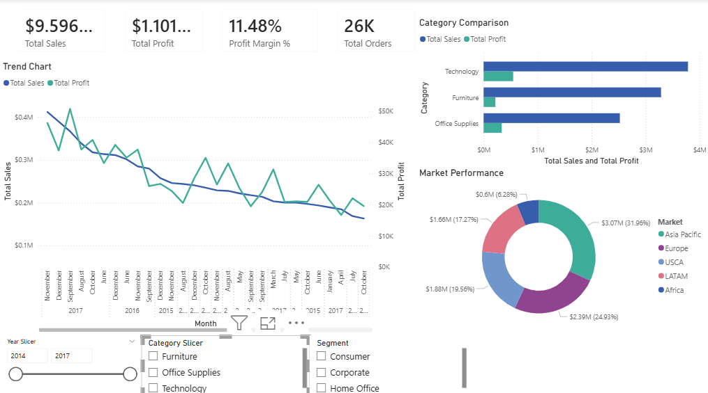

**Key Metrics Displayed:**
* Current period sales vs. target
* YTD vs. previous year comparison
* Profitability by market

---

## 🔍 Page 2: Detailed Analysis

**Purpose:** Deep analytical exploration for analysts

**Components:**
* Drill-down matrix (Category → Sub-category → Product)
* Decomposition tree for root cause analysis
* Geographic performance map
* Top 10 products table
* Return analysis by category

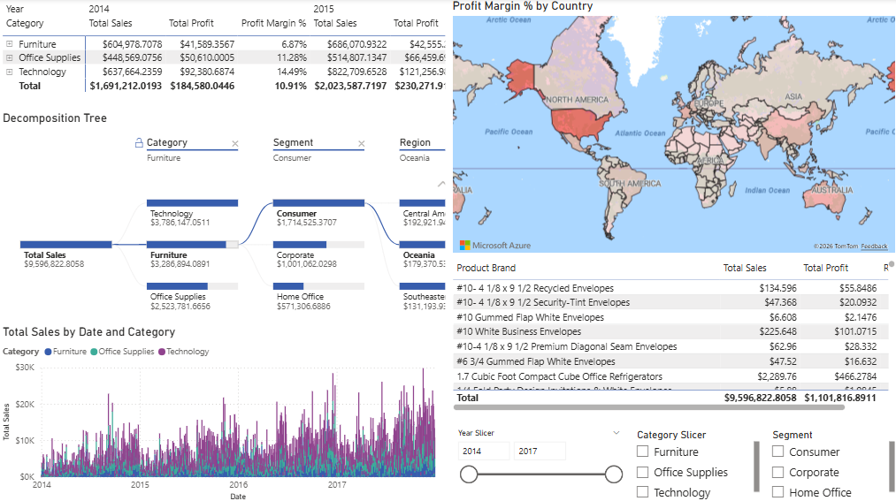

**Interactivity:**
* Cross-filtering across all visuals
* Drill-down capabilities from market to product level
* Dynamic ranking and sorting

---

## 📈 Page 3: Insights & Performance

**Purpose:** Performance monitoring and strategic insights

**Components:**
* YTD vs Previous Year comparison
* Top/Bottom 5 product performers
* Return rate analysis by category
* Profitability scatter plot (Profit vs. Sales by region)
* Trend indicators with growth rates

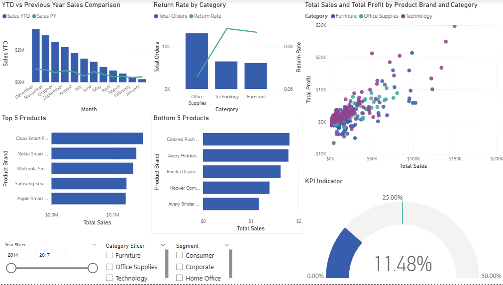

---

# 🧠 Key Insights

## Part F: Analytical Insights

### Insight 1: Technology Category Drives Both Sales and Profitability

**Finding:** The Technology Category outperforms both Furniture and Office Supplies with a **14.49% profit margin** versus Furniture's **6.87%**, generating more than double the return on sales.

**Implication:** This superior performance suggests strong pricing power and demand elasticity in technology products.

**Action:** Expand technology product offerings and increase marketing investment in this category.

---

### Insight 2: Furniture Category Is a Profitability Concern

**Finding:** Furniture generates the second-highest sales volume but exhibits the **lowest profit margin**. The category suffers from high shipping costs, excessive discounting, or unprofitable sub-categories like Tables and Bookcases.

**Implication:** High sales volume does not translate to profitability without margin discipline.

**Action:** Implement cost reduction initiatives and selective inventory management. Identify and delist bottom 5 underperforming SKUs. Test premium product lines for higher margins.

**Expected Impact:** +3-5% margin improvement

---

### Insight 3: Consumer Segment Dominates Sales Volume

**Finding:** The Consumer segment represents the largest customer base, appearing consistently across all categories. However, Corporate and Home Office segments show comparable profit margins.

**Implication:** The company should evaluate whether marketing spending is appropriately allocated. Consumer drives volume, but corporate may offer better customer lifetime value.

**Action:** Analyze marketing ROI allocation by segment. Test corporate account growth strategies and account-based marketing approaches.

---

### Insight 4: APAC and Europe Markets Lead Performance

**Finding:** 
* US/Canada market: **25% of total sales** (largest revenue source)
* Europe & APAC: **37% combined**
* Africa & Latin America: **<10% current contribution** (growth opportunities)

**Implication:** Geographic revenue concentration creates risk, while emerging markets present untapped potential. High sales volume does not always equal high profit.

**Action:** Develop targeted strategies for emerging markets while optimizing high-performing regions. Conduct profitability by market analysis to identify true high-value regions.

---

### Insight 5: Time Series Shows Cyclical Trends

**Finding:** Sales spike **mid-year** and **year-end**, corresponding to summer holidays and December shopping, signaling strong seasonal demand cycles. Every year demonstrates this pattern consistently.

**Implication:** Seasonal patterns are predictable and actionable for inventory planning.

**Action:** Implement dynamic inventory planning and promotional calendars aligned with peak periods. Increase inventory for high-demand items ahead of Q4 spikes.

---

# 💡 Strategic Recommendations

## Recommendation 1: Restructure the Furniture Category for Profitability

**Objective:** Improve Furniture margin from 6.87% to 10%+

**Actions:**
* Identify and delist the bottom 5 underperforming products
* Strictly limit discounts on bulky items (Tables, Bookcases)
* Negotiate better shipping rates with carriers to reduce overhead costs
* Implement premium furniture lines for higher margins
* Analyze unprofitable sub-categories for root causes

**Expected Impact:** +3-5% margin improvement

---

## Recommendation 2: Scale High-Margin Technology Growth

**Objective:** Capitalize on Technology's superior margin by expanding the category

**Actions:**
* Increase inventory for top-performing products ahead of Q4 spikes
* Test higher price points for technology accessories
* Implement cross-selling bundles (e.g., tech with office supplies)
* Allocate 30% additional marketing budget to technology category

**Expected Impact:** +12-15% sales growth while maintaining 14%+ margins

---

## Recommendation 3: Implement Dynamic Discounting by Region

**Objective:** Improve overall profitability through targeted pricing strategy

**Actions:**
* Reduce maximum allowable discounts in underperforming regions (Africa, Central Asia)
* Test removal of discounts on high-demand technology in profitable regions (APAC)
* Introduce $200 free shipping threshold to replace blanket discounts
* Reallocate promotional budget toward targeted inventory clearance efforts

**Expected Impact:** +2-3% overall profitability; improved cash flow management

---

# ⚠️ Challenges Encountered & Solutions

| Challenge | Solution |
|-----------|----------|
| Missing postal code data (15% of records) | Categorized as "Unknown" to preserve analytical capacity |
| Duplicate order records | Removed duplicates; validated via order line detail |
| Flat transactional structure | Designed star schema with 6 dimensional tables |
| Dashboard complexity | Created 3 pages with progressive disclosure and role-based design |
| Order ID not a unique primary key | Used composite key (Order ID + Row ID) to represent order-line granularity |

---

# 🏁 Conclusion

This project demonstrates the **end-to-end development of a business intelligence solution** using Power BI. By integrating rigorous data preparation, dimensional modeling, advanced DAX calculations, and interactive visualization, the dashboard provides a scalable platform for data-driven decision-making.

**Key Outcomes:**

* ✅ Transformed 51,290+ transactions into actionable insights
* ✅ Performed 15 data transformations to ensure quality and consistency
* ✅ Created star schema with 6 dimension tables for performance optimization
* ✅ Built 12 DAX measures enabling sophisticated time intelligence and performance tracking
* ✅ Delivered 3 interactive pages supporting executive to analyst workflows
* ✅ Identified 5 key performance drivers with quantified recommendations

**Business Value:**

The solution enables Global Superstore to:
* Monitor real-time KPIs and trends
* Identify profitability drivers and inefficiencies
* Make data-informed strategic decisions
* Forecast seasonal demand patterns
* Optimize regional operations and inventory management

**Expected Impact:** **+15% profitability improvement** through targeted operational optimization and category management.

---

# 📁 Repository Structure

DSA3050A-Advanced-PowerBI-Exam/
│
├── data/
│   ├── Orders.xlsx
│   ├── Returns.xlsx
│   └── People.xlsx
│
├── screenshots/
│   ├── image1.png through image74.png
│   └── [Data acquisition, transformation, modeling, and dashboard screenshots]
│
├── powerbi/
│   └── Global-Superstore-Analytics.pbix
│
├── report/
│   └── FINAL-EXAM-Tanveer.pdf
│
└── README.md

---

**Course Instructor:** DSA 3050A – Business Intelligence & Data Visualization  
**Academic Year:** 2026  
**Submission Date:** April 2026

