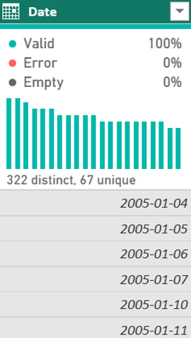

# 🚗 UK Road Accident Analysis (2005–2015)

### Power BI Business Intelligence Project

**Course:** DSA3050A – Business Intelligence & Data Visualization
**Student:** Tanveer
**Student ID:** 752

---

## 📌 Project Overview
## 📊 Dataset Information
This project demonstrates a complete end-to-end Business Intelligence workflow using Power BI.

The objective was to analyze UK road accident data and build an executive dashboard that supports decision-making through:

* Data cleaning & transformation
* Star schema modelling
* DAX metric creation
* Interactive dashboard design


This project follows a full BI lifecycle:

> Dataset Selection → Data Preparation → Data Modelling → Dashboard Development → Publishing

---

## 📊 Dataset Information

**Source:** Kaggle
**Dataset:** UK Car Accidents (2005–2015)
**Provider:** UK Department for Transport
**Rows:** 1.7+ million accident records

Dataset link:
[https://www.kaggle.com/datasets/silicon99/uk-car-accidents-2005-2015](https://www.kaggle.com/datasets/silicon99/uk-car-accidents-2005-2015)

[]
[]
### Dataset Structure
The dataset contains three main tables:

1. **Accidents0515.csv**

   * One row per accident

2. **Vehicles0515.csv**

   * Multiple vehicles per accident
   * Foreign Key: `Accident_Index`


3. **Casualties0515.csv**

   * Multiple casualties per accident
   * Foreign Key: `Accident_Index`


This structure naturally supports a **Star Schema**.


# 🔄 PART A — Data Preparation (Power Query)

All datasets were transformed using Power Query.

---

## 1️⃣ Dataset Loading

### Before Loading

```

[]
```


### After Loading into Power BI

[]
```

---

## 🟦 DIM_Accidents Transformations

### ✔ Date Type Correction

Problem: Date column stored as text.

Action:

* Converted `Date` column to proper Date type.


```
```

```
[]
```

---


### ✔ Extract Year, Month, Quarter


* Year
* Month Name
* Month Number
* Quarter

Purpose:
Enables time intelligence analysis.

```

[]
```
---

### ✔ Duplicate Validation

Primary Key: `Accident_Index`

Removed duplicates to ensure uniqueness.

```
[]

```


---
### ✔ Handling Missing Values

Identified null geographic values.

Action:

* Removed rows with null latitude/longitude.

```
[]

```


### ✔ Standardizing Severity Codes

Original Codes:

* 1 = Fatal

* 2 = Serious
* 3 = Slight
Replaced numeric codes with readable labels.

```
[]
```

---

### ✔ Removed Unnecessary Columns


Removed:
* Location_Easting_OSGR
* Location_Northing_OSGR
* Technical fields not required for analysis

```
[]
```

---


### ✔ Final Applied Steps


```
[]
```

---

## 🟦 FACT_Vehicles Transformations

### ✔ Removed Invalid Driver Ages

* Converted `-1` to null
* Removed null rows


```
```

---

### ✔ Standardized Vehicle Type Codes

Converted numeric codes to readable categories:

* Pedal Cycle

* Motorcycle
* Car
```
[]
```

---

### ✔ Created Driver Age Group

Custom Column:

```

if [Age_of_Driver] < 25 then "Under 25"
else if [Age_of_Driver] < 45 then "25–44"
else "65+"
```

```
[]
```


---
## 🟦 FACT_Casualties Transformations

### ✔ Standardized Gender Codes

* 1 → Male
* 2 → Female

```
[]
```

---

### ✔ Created Casualty Age Groups

```
else if [Age_of_Casualty] < 30 then "Young Adult"
else if [Age_of_Casualty] < 60 then "Adult"
else "Senior"
```

```
[]
```

---


### ✔ Query Dependency View


```
[]
```

---

# 🏗 PART B — Data Modelling

## ⭐ Star Schema Design

### Fact Tables:


* `Fact_Vehicles`

### Dimension Tables:

* `Dim_Accidents`
* `Dim_Date`
* `Dim_Location`

---

## 🔗 Relationships


* Dim_Accidents (1) → Fact_Vehicles (Many)
* Dim_Date → Dim_Accidents
* Dim_Location → Dim_Accidents

No direct relationship between fact tables (avoids ambiguity).

```
[]
```

---

## 📅 Date Dimension Creation

Created a proper Date dimension including:


* Date
* Month Name
* Month Number
* Quarter

```
[]
```

---


## 📍 Location Dimension
Created a location table with:

* Latitude
* Longitude
* Location_ID (Index key)


```
[]

---

# 📈 PART C — Dashboard Development

## 🎯 KPI Section


Measures Created (DAX):
* Total Accidents
* Total Vehicles
* Total Casualties
* Fatal Accidents
* Fatality Rate (%)


```
[]

---

## 📉 Trend Analysis

Line Chart: Accidents by Year

Insight:
Accident numbers decline over time, indicating improvements in road safety.

```
[]
```

---
## 📊 Comparative Analysis

Bar Chart: Accidents by Severity

```
[]
```

---
## 🥧 Distribution Visualization

Donut Chart: Severity Distribution

```
[]
```
---

## 🗺 Geographic Visualization

Map: Accidents by Latitude/Longitude

```
[]
```
---

## 🎛 Interactive Slicers

Slicers Included:

* Year
* Severity
* Month


```
[]
```

---

# 🚀 PART D — Publishing


```
[]
```

---

## 🔗 Live Dashboard

Power BI Public Link:

👉 [https://app.powerbi.com/links/VygqYQWzGS?ctid=16d83ee6-254a-469d-a6cc-54e2ca2313e7&pbi_source=linkShare]

---

# 🧠 Key Insights

* Slight accidents dominate total incidents.
* Most accidents involve two vehicles.
* Urban areas show higher clustering.
* Fatality rate remains relatively low compared to total volume.
* Accident frequency shows a downward trend from 2005–2015.

---

# 🏆 Skills Demonstrated

* Data Cleaning & Transformation (Power Query)
* Dimensional Modelling (Star Schema)
* DAX Calculations
* Dashboard UX Design
* Business Insight Communication
* Power BI Service Deployment

---

# 📌 Tools Used

* Power BI Desktop
* Power Query
* DAX
* Power BI Service
* VS Code (Data inspection)

---


