# 🚗 UK Road Accident Analysis (2005–2015)

### Power BI Business Intelligence Project

**Course:** DSA3050A – Business Intelligence & Data Visualization
**Student:** Tanveer
**Student ID:** 752

---

# 📌 Project Overview

This project demonstrates a complete end-to-end Business Intelligence workflow using Power BI.

The objective was to analyze UK road accident data and build an executive dashboard that supports decision-making through:

* Data cleaning & transformation
* Star schema modelling
* DAX metric creation
* Interactive dashboard design

This project follows a full BI lifecycle:

> Dataset Selection → Data Preparation → Data Modelling → Dashboard Development → Publishing

---

# 📊 Dataset Information

**Source:** Kaggle
**Dataset:** UK Car Accidents (2005–2015)
**Provider:** UK Department for Transport
**Rows:** 1.7+ million accident records

Dataset link:
[https://www.kaggle.com/datasets/silicon99/uk-car-accidents-2005-2015](https://www.kaggle.com/datasets/silicon99/uk-car-accidents-2005-2015)

### Dataset Preview


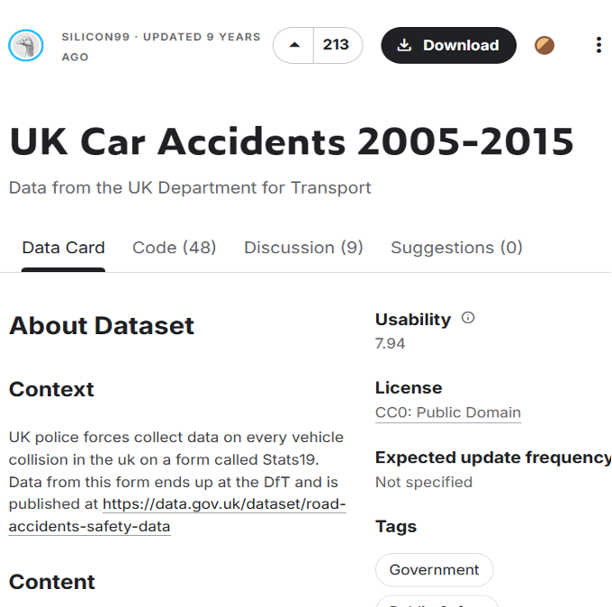

---

## Dataset Structure

The dataset contains three main tables:

### 1️⃣ Accidents0515.csv

* One row per accident

### 2️⃣ Vehicles0515.csv

* Multiple vehicles per accident
* Foreign Key: `Accident_Index`

### 3️⃣ Casualties0515.csv

* Multiple casualties per accident
* Foreign Key: `Accident_Index`

### Loading into Power BI

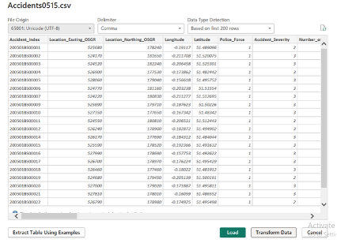
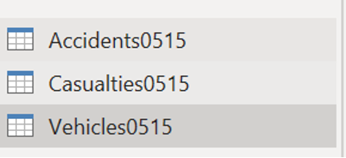

This structure naturally supports a **Star Schema**.

---

# 🔄 PART A — Data Preparation (Power Query)

All datasets were transformed using Power Query.

---

## 🟦 DIM_Accidents Transformations

### ✔ Date Type Correction

Problem: Date column stored as text.

Action:

* Converted `Date` column to proper Date type.

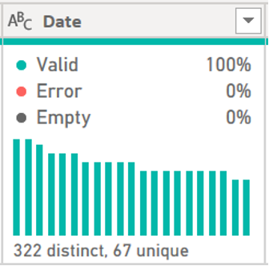

---

### ✔ Extract Year, Month, Quarter

Created:

* Year
* Month Name
* Month Number
* Quarter

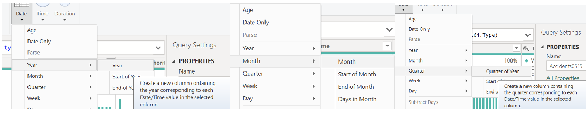

---

### ✔ Duplicate Validation

Primary Key: `Accident_Index`

Removed duplicates to ensure uniqueness.

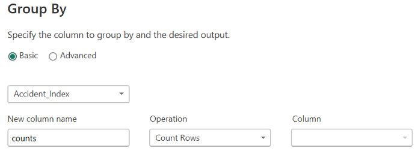

---

### ✔ Handling Missing Values

Identified null geographic values.

Action:

* Removed rows with null latitude/longitude.

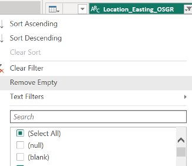

---

### ✔ Standardizing Severity Codes

Original Codes:

* 1 = Fatal
* 2 = Serious
* 3 = Slight

Replaced numeric codes with readable labels.

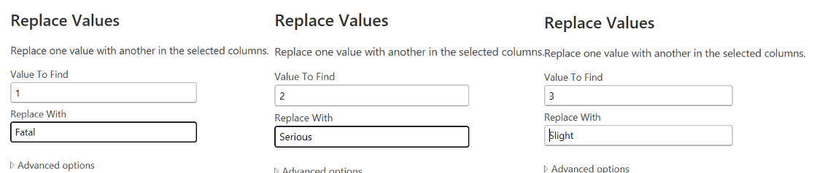

---

### ✔ Removed Unnecessary Columns

Removed:

* Location_Easting_OSGR
* Location_Northing_OSGR
* Technical fields not required for analysis

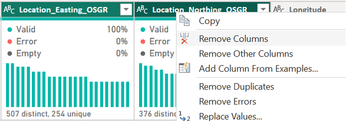

---

### ✔ Final Applied Steps

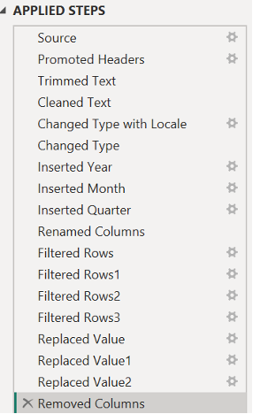

---

# 🟦 FACT_Vehicles Transformations

### ✔ Removed Invalid Driver Ages

* Converted `-1` to null
* Removed null rows

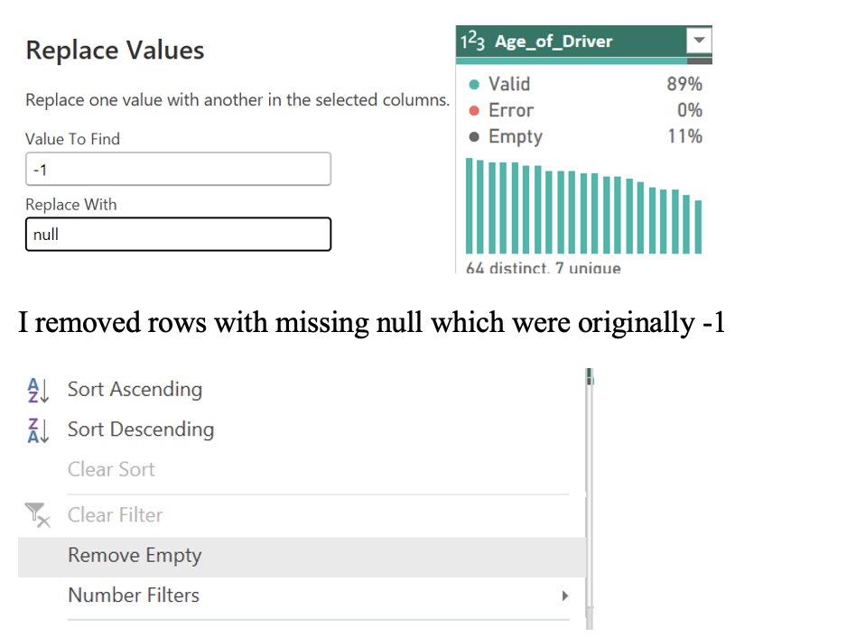

---

### ✔ Standardized Vehicle Type Codes

Converted numeric codes to readable categories:

* Pedal Cycle
* Motorcycle
* Car

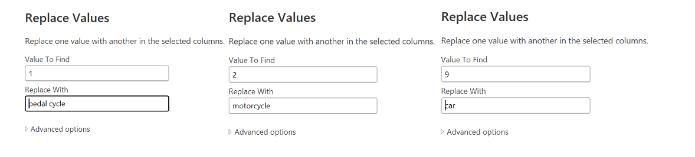

---

### ✔ Created Driver Age Group

Custom Column:

```
if [Age_of_Driver] < 25 then "Under 25"
else if [Age_of_Driver] < 45 then "25–44"
else if [Age_of_Driver] < 65 then "45–64"
else "65+"
```

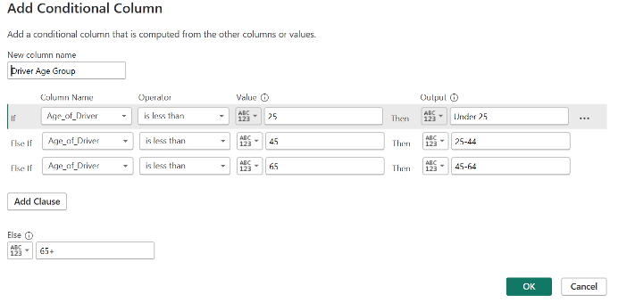

---

# 🟦 FACT_Casualties Transformations

### ✔ Standardized Gender Codes

* 1 → Male
* 2 → Female

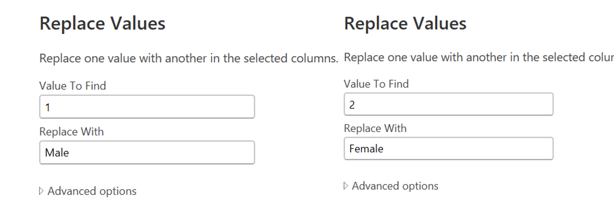

---

### ✔ Created Casualty Age Groups

```
if [Age_of_Casualty] < 18 then "Child"
else if [Age_of_Casualty] < 30 then "Young Adult"
else if [Age_of_Casualty] < 60 then "Adult"
else "Senior"
```

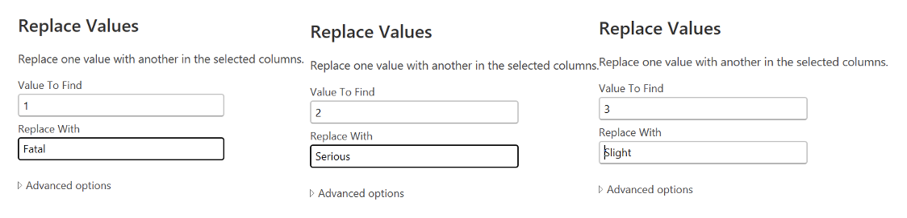

---

### ✔ Query Dependency View

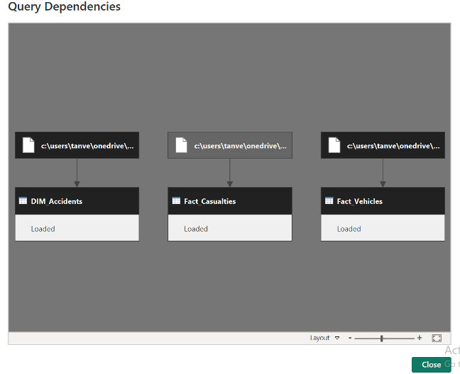

---

# 🏗 PART B — Data Modelling

## ⭐ Star Schema Design

### Fact Tables

* `Fact_Vehicles`
* `Fact_Casualties`

### Dimension Tables

* `Dim_Accidents`
* `Dim_Date`
* `Dim_Location`

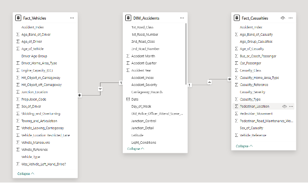

---

## 📅 Date Dimension Creation

Created a proper Date dimension including:

* Date
* Month Name
* Month Number
* Quarter

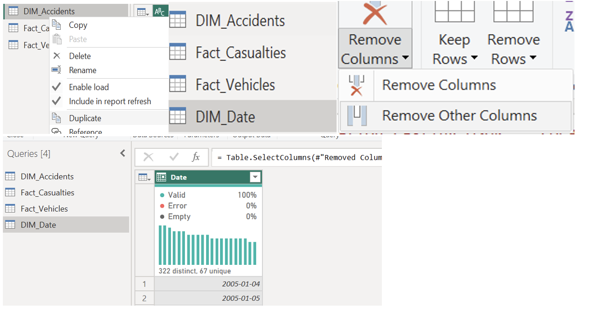

---

## 📍 Location Dimension

Created a location table with:

* Latitude
* Longitude
* Location_ID (Index key)

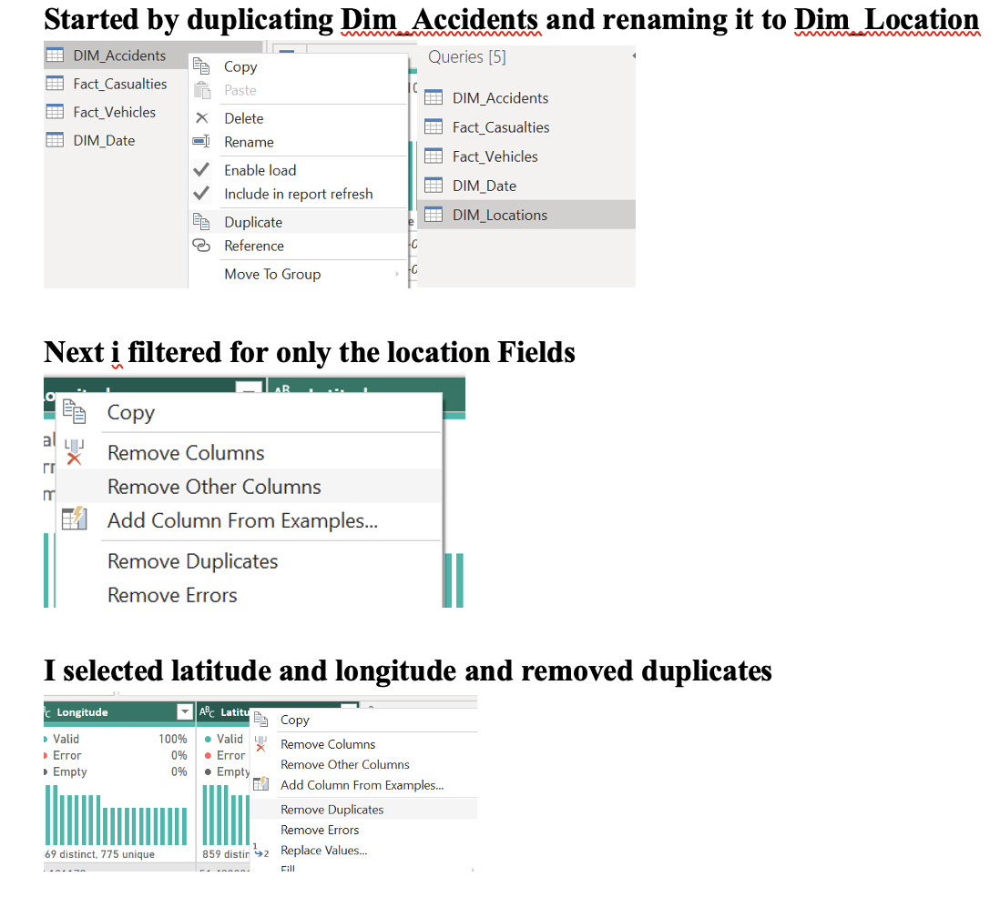

---

# 📈 PART C — Dashboard Development

## 🎯 KPI Section

Measures Created (DAX):

* Total Accidents
* Total Vehicles
* Total Casualties
* Fatal Accidents
* Fatality Rate (%)

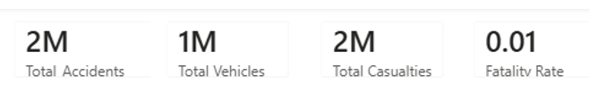

---

## 📉 Trend Analysis

Line Chart: Accidents by Year

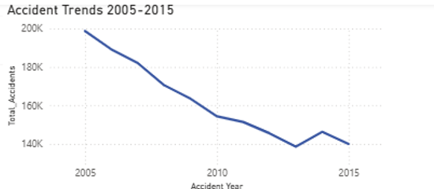

---

## 📊 Comparative Analysis

Bar Chart: Accidents by Severity

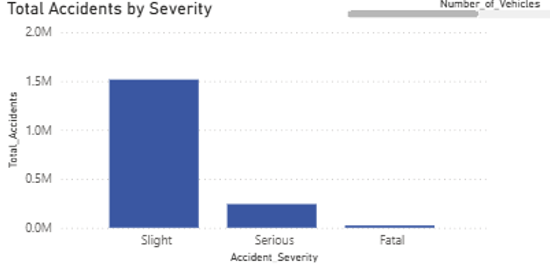

---

## 🥧 Distribution Visualization

Donut Chart: Severity Distribution

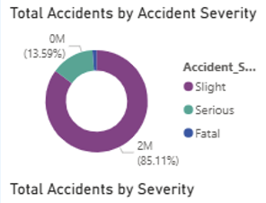

---

## 🗺 Geographic Visualization

Map: Accidents by Latitude/Longitude

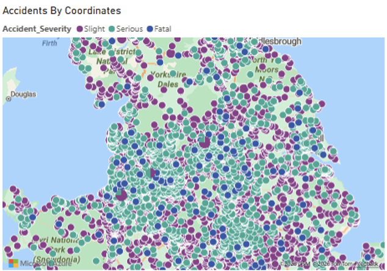

---

## 🎛 Interactive Slicers

Slicers Included:

* Year
* Severity
* Month

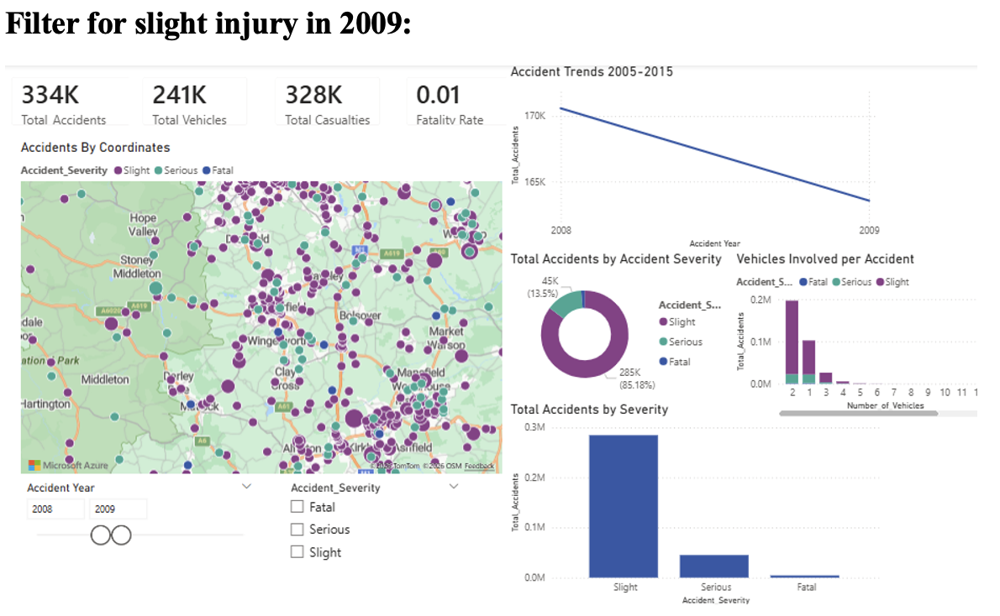

---

# 🚀 PART D — Publishing


---

# 🔗 Live Dashboard

👉 [https://app.powerbi.com/links/VygqYQWzGS?ctid=16d83ee6-254a-469d-a6cc-54e2ca2313e7&pbi_source=linkShare](https://app.powerbi.com/links/VygqYQWzGS?ctid=16d83ee6-254a-469d-a6cc-54e2ca2313e7&pbi_source=linkShare)

---

# 🧠 Key Insights

* Slight accidents dominate total incidents.
* Most accidents involve two vehicles.
* Urban areas show higher clustering.
* Fatality rate remains relatively low compared to total volume.
* Accident frequency shows a downward trend from 2005–2015.


